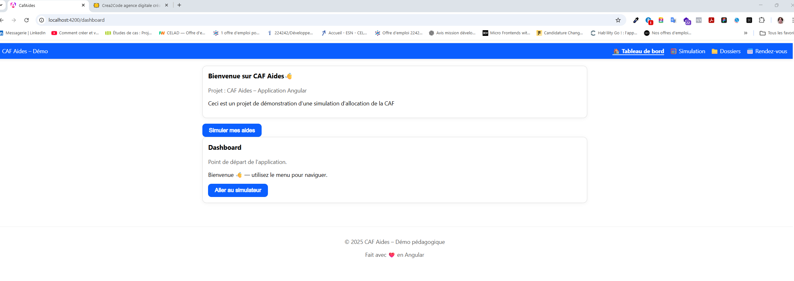
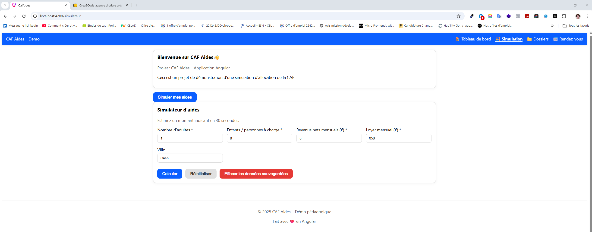
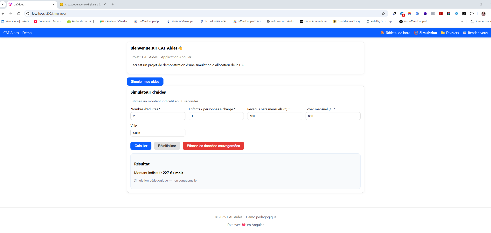
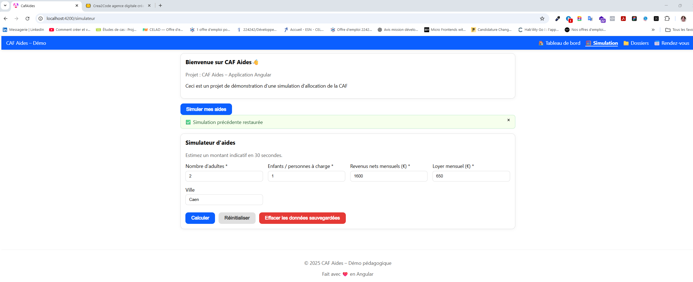
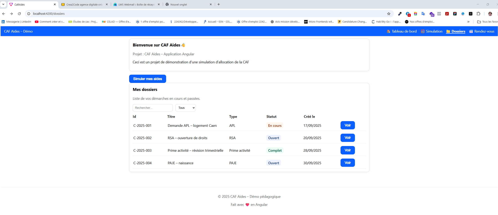
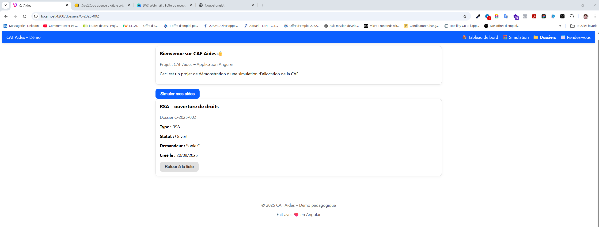

# 🏛️ CAF Aides – Plateforme d’aide sociale (Demo App)


[](https://crea2code.github.io/caf-aides/)


Une application Angular moderne conçue pour simuler les aides sociales de la CAF et centraliser les démarches des usagers.  
Ce projet est développé dans un contexte d'apprentissage professionnel en environnement **front-end moderne (Angular)**, avec une architecture **micro-frontends ready**, CI/CD automatisée, et un design modulaire orienté composants standalone.

---

## 🚀 Objectifs du projet

- 💻 Créer une interface moderne pour consulter les aides disponibles  
- 🧮 Développer un simulateur de droits basé sur des données fictives  
- 📂 Gérer les dossiers et rendez-vous des utilisateurs  
- 🛠️ Mettre en œuvre de bonnes pratiques pro : **CI/CD**, **Clean Git Workflow**, **routing**, **components réutilisables**  
- 🧑‍💻 Démontrer mes compétences front-end dans un projet structuré

---

## 🛠️ Stack technique

| Technologie | Rôle |
|------------|------|
| **Angular 17+** | Framework front-end |
| **TypeScript** | Langage principal |
| **SCSS** | Styles modulaires |
| **Standalone Components** | Architecture moderne sans NgModule |
| **Angular Router** | Gestion des routes |
| **Reactive Forms** *(à venir)* | Gestion des formulaires |
| **GitHub Actions** | CI/CD automatisée |
| **Zone.js / SSR Ready** | Compatibilité serveur et navigateur |

---

## 📁 Structure du projet

## 📁 Arborescence du projet

```bash
src/
├─ app/
│  ├─ app.component.ts           # Composant racine
│  ├─ app.routes.ts              # Définition des routes
│  ├─ app.config.ts              # Configuration globale de l'application
│  ├─ shared/
│  │  └─ components/             # Composants réutilisables
│  │     ├─ header/              # En-tête global
│  │     ├─ footer/              # Pied de page
│  │     ├─ button/              # Bouton générique
│  │     └─ card/                # Carte d'information
│  └─ features/                  # Pages et fonctionnalités principales
│     ├─ dashboard/              # Page principale (accueil)
│     └─ simulator/              # Simulateur de droits
      └─ /dossiers               # fonctionnelle (liste, filtres, détails)
└─ assets/                       # Images, styles, données statiques
```


## 📸 Captures d’écran

<p align="center">
  
</p>
<p align="center">
  
</p>
<p align="center">
  
</p>
<p align="center">
  
</p>
<p align="center">
  
</p>
<p align="center">
  
</p>

## 🧭 Fonctionnalités actuelles

✅ **Dashboard**  
- Page d’accueil avec navigation centrale  
- Composants réutilisables : `Header`, `Footer`, `Card`, `Button`  

✅ **CI/CD**  
- Pipeline GitHub Actions : lint + build automatique à chaque push/PR  
- Badge de statut visible dans ce README

📦 **À venir**  
- 🧮 Simulateur de droits CAF  
- 📁 Gestion des dossiers utilisateurs  
- 📅 Module de prise de rendez-vous  
- 🧑‍💻 Authentification et espace personnel


## ⚙️ Installation & exécution

### 1. Cloner le projet
```bash
git clone https://github.com/Crea2Code/caf-aides.git
cd caf-aides
```

### 2. Installer les dépendances
npm install

### 3. Lancer en mode développement
ng serve -o

### 📍 L’application sera disponible sur http://localhost:4200

🧪 **Scripts utiles**

| Commande              | Description                |
| --------------------- | -------------------------- |
| `npm run lint`        | Analyse du code            |
| `npm run build`       | Build production           |
| `ng serve`            | Lancer en développement    |
| `ng test` *(à venir)* | Lancer les tests unitaires |

📈 Workflow Git Pro

Créer une branche : git checkout -b feature/nom-feature

Commiter régulièrement avec Conventional Commits

Ouvrir une Pull Request vers main

Laisser passer la CI ✅

Merger après validation

## 🧑‍💻 Auteur

👩‍💻 **Sonia Chalal**
Développeuse Front-End en reconversion / évolution vers le Full Stack.
Passionnée par les technologies web modernes, l’automatisation et la création de solutions utiles à impact social.

🔗 **LinkedIn**
https://www.linkedin.com/in/sonia-chalal-46a16b1bb/

🔗 **site web**
https://crea2code.fr/

### 📜 Licence

Ce projet est diffusé à titre éducatif et démonstratif dans le cadre d’un apprentissage professionnel.
Libre d’être consulté, forké ou utilisé comme référence.


